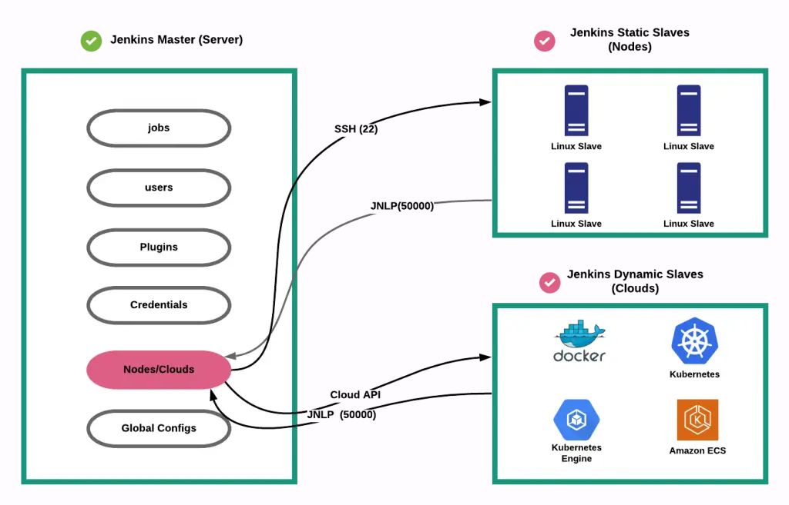

# How Jenkins works ?

- [1. Jenkins Master Slave Architecture](#1-jenkins-master-slave-architecture)
  - [1.1. Jenkins controller/Jenkins master node](#11-jenkins-controllerjenkins-master-node)
  - [1.2. Nodes](#12-nodes)
  - [1.3. Agents](#13-agents)
  - [1.4. Executors](#14-executors)
  - [1.5. Jobs](#15-jobs)
- [2. Jenkins dynamic node](#2-jenkins-dynamic-node)

Source: [https://www.jenkins.io/doc/book/managing/nodes/](https://www.jenkins.io/doc/book/managing/nodes/)

Source glossary: [https://www.jenkins.io/doc/book/glossary/](https://www.jenkins.io/doc/book/glossary/)

## 1. Jenkins Master Slave Architecture

The Jenkins **controller** is the **master node** which is able to launch
**jobs** on different **nodes** (machines) directed by an **Agent**. The Agent
can the use one or several **executors** to execute the job(s) depending on
configuration.

Jenkins is using Master/Slave architecture with the following components:

### 1.1. Jenkins controller/Jenkins master node

> The central, coordinating process which stores configuration, loads plugins,
> and renders the various user interfaces for Jenkins.

The Jenkins controller is the Jenkins service itself and is where Jenkins is
installed. It is a webserver that also acts as a "brain" for deciding how, when
and where to run tasks. Management tasks (configuration, authorization, and
authentication) are executed on the controller, which serves HTTP requests.
Files written when a Pipeline executes are written to the filesystem on the
controller unless they are off-loaded to an artifact repository such as Nexus
or Artifactory.

### 1.2. Nodes

> A machine which is part of the Jenkins environment and capable of executing
> [Pipelines](https://www.jenkins.io/doc/book/glossary/#pipeline)
> or [jobs](https://www.jenkins.io/doc/book/glossary/#job). Both the
> [Controller](https://www.jenkins.io/doc/book/glossary/#controller) and
> [Agents](https://www.jenkins.io/doc/book/glossary/#agent) are considered to
> be Nodes.

Nodes are the "**machines**" on which build agents run. Jenkins monitors each
attached node for disk space, free temp space, free swap, clock time/sync and
response time. A node is taken offline if any of these values go outside the
configured threshold.

The Jenkins controller itself runs on a special _built-in node_. It is possible
to run agents and executors on this built-in node although this can degrade
performance, reduce scalability of the Jenkins instance, and create serious
security problems and is strongly discouraged, especially for production
environments.

### 1.3. Agents

> An agent is typically a machine, or container, which connects to a Jenkins
> controller and executes tasks when directed by the controller.

Agents manage the task execution on behalf of the Jenkins controller by using
executors. An agent is actually a small (170KB single jar) Java client process
that connects to a Jenkins controller and is assumed to be unreliable. An agent
can use any operating system that supports Java. Tools required for builds and
tests are installed on the node where the agent runs; they can be installed
directly or in a container (Docker or Kubernetes). Each agent is effectively a
process with its own PID (Process Identifier) on the host machine.

> In practice, nodes and agents are essentially the same but it is good to
> remember that they are conceptually distinct.

### 1.4. Executors

> A slot for execution of work defined by a [Pipeline](https://www.jenkins.io/doc/book/glossary/#pipeline)
> or [job](https://www.jenkins.io/doc/book/glossary/#job) on a
> [Node](https://www.jenkins.io/doc/book/glossary/#node). A Node may have zero
> or more Executors configured which corresponds to how many concurrent Jobs or
> Pipelines are able to execute on that Node.

An executor is a slot for execution of tasks; effectively, it is a thread in
the agent. The number of executors on a node defines the number of concurrent
tasks that can be executed on that node at one time. In other words, this
determines the number of concurrent Pipeline stages that can execute on that
node at one time.

The proper number of executors per build node must be determined based on the
resources available on the node and the resources required for the workload.
When determining how many executors to run on a node, consider CPU and memory
requirements as well as the amount of I/O and network activity:

- One executor per node is the safest configuration.
- One executor per CPU core may work well if the tasks being run are small.
- Monitor I/O performance, CPU load, memory usage, and I/O throughput carefully
  when running multiple executors on a node.

### 1.5. Jobs

> A user-configured description of work which Jenkins should perform,
> such as building a piece of software, etc.

## 2. Jenkins dynamic node

Jenkins has static slave nodes and can trigger the generation of dynamic slave nodes

