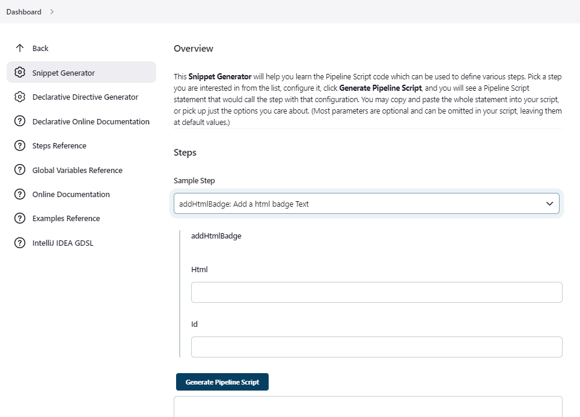
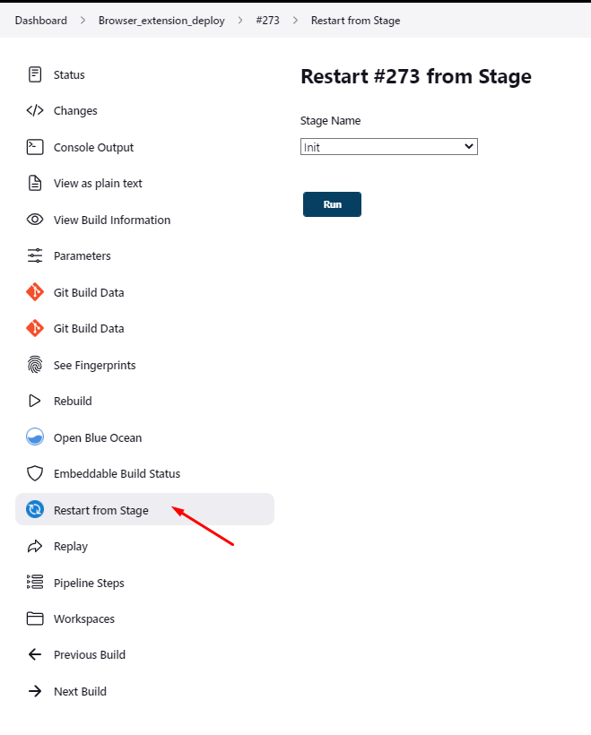
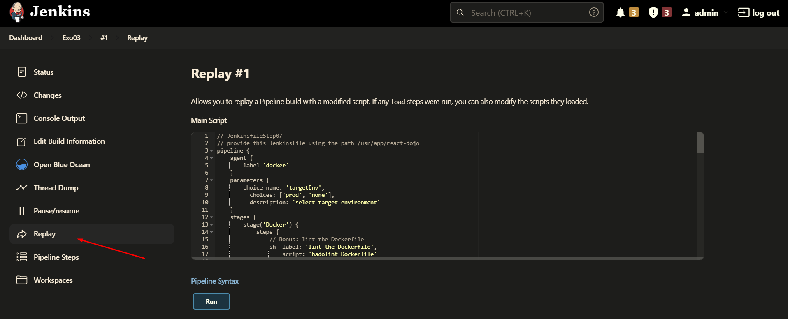

# Jenkins recipes/tips

- [1. Jenkins snippet generator](#1-jenkins-snippet-generator)
- [2. Declarative pipeline allows you to restart a build from a given stage](#2-declarative-pipeline-allows-you-to-restart-a-build-from-a-given-stage)
- [3. Replay a pipeline](#3-replay-a-pipeline)
- [4. VS code Jenkinsfile validation](#4-vs-code-jenkinsfile-validation)
- [5. How to chain pipelines ?](#5-how-to-chain-pipelines-)
- [6. Viewing pipelines hierarchy](#6-viewing-pipelines-hierarchy)

## 1. Jenkins snippet generator

Use jenkins snippet generator by adding `/pipeline-syntax/` to your jenkins pipeline. to allow you to generate jenkins pipeline code easily with inline doc. It also list the available variables.



## 2. Declarative pipeline allows you to restart a build from a given stage



## 3. Replay a pipeline

Replaying a pipeline allows you to update your jenkinsfile before replaying the pipeline, easier debugging !


## 4. VS code Jenkinsfile validation

Please follow this documentation [enable jenkins pipeline linter in vscode](https://github.com/fchastanet/coding_dojo_jenkins/blob/master/Exercise03.md#step-01b---enable-jenkins-pipeline-linter-in-vscode)

## 5. How to chain pipelines ?

Simply use the `build` directive followed by the name of the build to launch

```groovy
build 'OtherBuild'
```

## 6. Viewing pipelines hierarchy

The [downstream-buildview plugin](https://plugins.jenkins.io/downstream-buildview/) allows to view the full chain of dependent builds.


