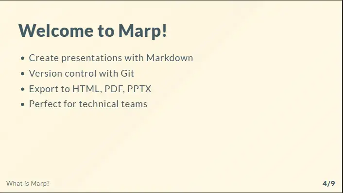

<!-- _footer: '' -->

# Marp Integration

## <!-- fit --> My-Documents Repository


**How I integrated Marp** **into my Hugo documentation site**

March 22, 2026

<!--
**Duration:** 1 minute

**Section:** Introduction

Welcome to this demo presentation! Today we'll explore how Marp was integrated into the my-documents repository, enabling
me to create beautiful, version-controlled presentations that are automatically built and deployed alongside
my Hugo documentation website.

This presentation covers the complete implementation from dependencies to deployment.

**Resources:**
- Marp Official Site: https://marp.app/
- My-Documents Repo: https://github.com/fchastanet/my-documents
-->

______________________________________________________________________

<!--
**Duration:** 2 minutes

**Section:** What is Marp?

Marp is a Markdown presentation ecosystem that revolutionizes how technical teams create presentations.
Instead of fighting with PowerPoint or Google Slides, I simply write Markdown - the same format I use for documentation.

The beauty of Marp is its simplicity. I write content in plain text, use familiar Markdown syntax for formatting, and
Marp handles the transformation into beautiful presentations. It supports multiple themes, custom styling, and exports
to various formats.

-->

<!-- header: What is Marp? -->

<style scoped>
section {
    font-size: 20px;
}
</style>

# 📝 What is Marp?

**Marp** = **Mar**kdown **P**resentation Ecosystem

A framework that lets you create presentations using simple Markdown syntax.

## Key Features

- ✍️ **Write slides in Markdown** - No complex editors needed
- 🎨 **Built-in themes** - Professional looks out of the box
- 📦 **Multiple export formats** - HTML, PDF, PPTX
- 🔄 **Version control friendly** - Track changes with Git
- 🎯 **Code-friendly** - Syntax highlighting included

## Resources

- Marp Documentation: <https://marpit.marp.app>
- Marp CLI: <https://github.com/marp-team/marp-cli>
- Visual example: <https://github.com/marp-team/awesome-marp>

______________________________________________________________________

<!--
**Duration:** 1 minute
Here a simple Marp example to illustrate how Markdown translates into a presentation format. On the left, you see the
Markdown source code for a simple slide. On the right, you see the rendered result as it would appear in a presentation.
-->

<style scoped>
  .columns {
    display: grid;
    grid-template-columns: repeat(2, minmax(0, 1fr));
    gap: 1rem;
  }
</style>

# Marp example

<div class="columns">
<div>

## Markdown

```markdown
# Welcome to Marp!

- Create presentations with Markdown
- Version control with Git
- Export to HTML, PDF, PPTX
- Perfect for technical teams
```

</div>
<div>

## Result



</div>
</div>

______________________________________________________________________

<!--
**Duration:** 1 minute
Several key benefits of using Marp for presentations in a documentation repository include:
- 📚 **Documentation-first**: Presentations live alongside docs
- 🤖 **AI friendly**: Use AI tools to generate Markdown content for slides
- 🤝 **Developer-friendly**: Use your favorite text editor
- 🚀 **CI/CD ready**: Automated builds and deployments
- 🔗 **Seamless integration**: Embed in Hugo with ease
- 💻 **Code snippets**: Render code snippets with syntax highlighting
- 📊 **Diagrams & visuals**: Support for Mermaid diagrams and more
- 🔢 **Automatic pagination**: Keep track of your slide numbers
- 🎉 **Professional output**: Beautiful slides without design work
-->

<style scoped>
section {
    font-size: 32px;
}
</style>

## Why Marp?

- 📚 **Documentation-first**
- 🤖 **AI friendly**
- 🤝 **Developer-friendly**
- 🚀 **CI/CD ready**
- 🔗 **Seamless integration**
- 💻 **Code snippets**
- 📊 **Diagrams & visuals**
- 🔢 **Automatic pagination**
- 🎉 **Professional output**

______________________________________________________________________

<!--
**Duration:** 2 minutes

**Section:** Implementation Step 1

The first step was setting up the build infrastructure. I added the Marp CLI as a development dependency in package.json,
which gives me the command-line tool to convert Markdown files into presentation formats.

I created two bash scripts:

The build-marp script is the workhorse. It searches the marp directory for all Markdown files, then uses the Marp CLI
to generate both HTML and PPTX versions. The HTML version is self-contained with all assets embedded, perfect for web
viewing. The PPTX version allows offline editing and presenting.

The pre-build script serves as an orchestrator, calling build-marp before Hugo runs. This ensures presentations are always
up-to-date when the site builds.

**Resources:**
- Marp CLI Installation: https://github.com/marp-team/marp-cli#install
- Our build-marp.sh: .github/scripts/build-marp.sh
-->

<style scoped>
section {
    font-size: 24px;
}
</style>

<!-- header: Build with Hugo -->

# 🔧 Step 1: Dependencies & Build Scripts

## Package Dependencies

Added to `package.json`:

```json
{
  "devDependencies": {
    "@marp-team/marp-cli": "^4.0.3"
  }
}
```

## Build Scripts Created

1. **`build-marp.sh`** - Converts Markdown → HTML & PPTX
2. **`pre-build.sh`** - Runs before Hugo builds

______________________________________________________________________

<!--
**Duration:** 2.5 minutes

**Section:** Build Process

Let me walk you through the complete build flow diagram shown on this slide.

It starts with Markdown presentation files stored in the marp directory. These are your source files, version-controlled
alongside your documentation.

The build-marp script discovers these files and invokes the Marp CLI for each one. The CLI performs the conversion,
generating two output formats: HTML files for web viewing and PPTX files for offline use or traditional presenting.

These generated files land in the static/presentations directory. This is crucial because Hugo automatically serves
anything in the static directory as-is. So when Hugo builds the site, these presentations become accessible at <https://devlab.top/presentations/>.

Finally, the entire site with embedded presentations deploys to GitHub Pages through the automated workflow. This means
every time you push changes to master, presentations rebuild and deploy automatically.

**Resources:**
- Hugo Static Files: <https://gohugo.io/content-management/static-files/>
- Build flow diagram source: (this presentation uses Mermaid for diagrams)
-->

<style scoped>
section {
    font-size: 24px;
}
</style>

# ⚙️ Step 2: Build Process Flow



## Key Points

- 📁 **Source**: `marp/` directory
- 📤 **Output**: `static/presentations/` directory
- 🌐 **Formats**: HTML (interactive) + PPTX (offline)
- 🔁 **Integration**: Automatic on every build

______________________________________________________________________

<!--
**Duration:** 2 minutes

**Section:** Hugo Integration

The final piece is making presentations easily accessible through Hugo and providing convenient build commands.

I integrated Marp into the Makefile with three key commands. The build-marp command lets you manually rebuild presentations
during development. The clean-marp command removes generated files when you need a fresh build. And crucially, the start
command now automatically builds presentations before starting the Hugo server, so you always see the latest version.

I also created a dedicated presentations documentation page in the Hugo content. This page serves as a catalog, listing
all available presentations with links to both the HTML version for browser viewing and PPTX for download. It also
includes instructions on keyboard shortcuts like pressing F for fullscreen or P for presenter notes.

The result is seamless integration. Presentations are automatically built, automatically deployed, and accessible through
clean URLs on your documentation site. They feel like a natural part of your documentation rather than separate external
files.

**Resources:**
- Presentations Page: https://devlab.top/my-documents/docs/presentations/
- Example: https://devlab.top/presentations/understanding-ai/understanding-ai-and-ml-presentation.html
- Makefile: See root Makefile for all available commands
-->

<style scoped>
section {
    font-size: 20px;
}
</style>

# 🌐 Step 3: Hugo Integration & Access

## Makefile Commands

```bash
make build-marp # Build presentations manually
make clean-marp # Remove generated files
make start      # Build + serve (includes presentations)
```

## Documentation Page

Created `content/docs/presentations/_index.md`:

- Lists all available presentations
- Links to HTML (web) and PPTX (download) versions
- Explains how to view and navigate slides

## Access Your Presentations

- 🔗 **Live**: `https://devlab.top/presentations/[name]/[file].html`
- 📥 **Download**: `https://devlab.top/presentations/[name]/[file].pptx`

______________________________________________________________________

<!--
**Duration:** 1 minute

**Section:** Conclusion

And that's it! We've successfully integrated Marp into our documentation repository.

The implementation gives us the best of both worlds: the simplicity of writing in Markdown combined with professional
presentation output. Presentations are now first-class citizens in our documentation, tracked in version control,
automatically built and deployed, and accessible in multiple formats.

The key takeaway is that this approach scales beautifully. Whether you have one presentation or fifty, the build process
handles them all automatically. Add a new markdown file to the marp directory, commit it, and within minutes it's live
on your site in both HTML and PPTX formats.

I encourage you to explore the presentations section on the site and try creating your own. The workflow is simple, the
results are professional, and it keeps everything in one place with your documentation.

**Resources:**
- Full documentation: /docs/presentations/
- Example presentations: /presentations/
- Source code: https://github.com/fchastanet/my-documents
- Marp documentation: https://marp.app/

**Next steps:** Try creating your own presentation by adding a .md file to the marp/ directory!
-->

<!-- header: Conclusion -->

<!-- _paginate: false -->

<style scoped>
section {
    font-size: 24px;
}
</style>

# <!-- fit -->🎉 Result: Seamless Integration


## ✅ What I Achieved

- 📝 Write presentations in Markdown
- 🔄 Version control with Git
- 🤖 Automated builds via CI/CD
- 🌐 Web-accessible HTML format
- 📥 Downloadable PPTX format
- 📚 Integrated with documentation

### **Try it yourself!**

Navigate to `/docs/presentations/` on the site
